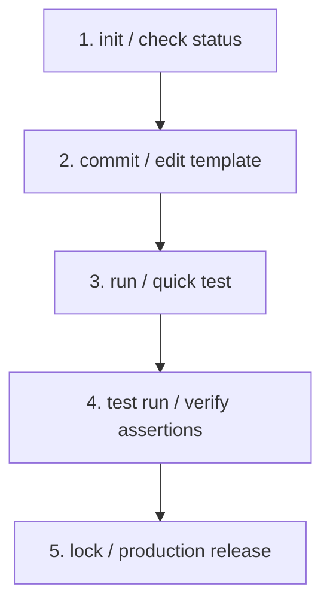

# promptvc

Prompt Version Control - A Git-Like CLI Tool and Execution Core for LLM Prompts.

---

## 1. Problem Statement

Prompts are load-bearing logical components in modern software architectures. They dictate data structures, govern agentic execution paths, and transform codebases. However, prompt engineering and integration workflows frequently lack the basic discipline applied to traditional source code.

In modern development environments, prompts suffer from the following systemic issues:
* Out-of-band management: Prompts are copy-pasted into Notion documents, shared over chat tools, or hardcoded directly in application source code.
* Missing version history: Prompt text is edited in place on production databases or server parameters with no version lineage, no change documentation, and no rollback mechanism.
* Silent regressions: Adjusting a prompt to fix an edge case on one input often degrades output quality across other inputs without triggering errors.
* Lack of observability: Latency, token consumption, and API cost metrics are rarely logged or mapped directly to the version of the prompt that generated them.

This lack of control introduces vulnerabilities when deploying LLM integrations to production. A single prompt modification can break backend parsing logic, escalate runtime API costs, or compromise model performance without developer visibility.

---

## 2. What This Tool Is (and Is NOT)

* It IS a local, version-controlled prompt registry: Prompts are saved in a structured, local format (`.promptvc/spaces/*.json`) using sequential, immutable version identifiers.
* It IS a declarative test and evaluation runner: Supports assertion verification (JSON validation, token counts, regex checks, semantic similarity) against evaluation datasets directly in the console.
* It IS a multi-provider execution abstraction: Runs templates across local instances (Ollama) and cloud APIs (OpenAI, Anthropic, Gemini) using a unified invocation format.
* It IS NOT a visual prompt playground: There are no web-based node diagrams, drag-and-drop elements, or third-party cloud hosting requirements.
* It IS NOT a framework-level runtime wrapper: It does not force you to write application code inside specific chains, agent classes, or SDK models.

---

## 3. Why This Tool Matters

By treating prompts as immutable, versioned code assets, this tool establishes a reliable local iteration loop:
* Reproducibility: Every execution log, evaluation result, and file change is mapped directly to a specific prompt space name, version ID, and SHA-256 hash.
* Testability: Automated test suites verify prompt outputs against assertions before updates are deployed.
* Control: Historical versions can be explicitly locked to protect stable production paths from unintended modifications.
* Transparency: Integrated token modeling estimates exact API costs and response latency across providers, preventing production cost overruns.

---

## 4. Core Features

### Immutable Versioning and Space Management
Prompts are organized into logical partitions called "spaces" (e.g., `summarize`, `code_generation`). Each commit registers a new immutable version.
* Auto-incrementing IDs (v1, v2, v3).
* Version hashes computed over raw prompt text.
* Author and message metadata logs.
* Lock gates: Running `lock` marks a version as read-only, raising errors if a developer attempts to modify or commit over it.

### Schema-Based Variable Injection
Prompts support template parameters using `{{variable}}` brackets. A version can optionally declare a JSON validation schema defining:
* Variable types (e.g., string, boolean).
* Required vs. optional flags.
* Default values (used automatically if no override is supplied).
* Documentation descriptions for interactive prompts.

### Declarative Unit Testing Engine
The test module provides a local, CI-ready testing framework:
* JSON-defined test cases specifying inputs, assertions, and checks.
* Composite Scoring: Runs rules and model evaluations to aggregate a normalized case score from 0.0 to 1.0.
* Rule-Based Assertions: `contains`, `not_contains`, `regex`, `json_valid`, `min_tokens`, `max_tokens`, and `golden`.
* Jaccard semantic similarity: The `golden` assertion measures similarity of token word-sets between execution output and a stored golden file.
* LLM-as-a-Judge: Validates free-form model assertions (e.g. style constraints, safety guidelines) using configurable evaluation prompts against LLMs.
* Regression Delta & Gates: Compares suite performance against a base version, generating a comparative score delta table, and failing CI with threshold gates.
* Automated updates: The `test golden` command runs the prompt version and overwrites or creates golden file records.

### Multi-Step Orchestration Pipelines
Execute multi-step prompt workflows sequentially using JSON declarations:
* Downstream step templates can reference upstream step outputs using the `{{ steps.step_id.output }}` syntax.
* Global pipeline variables are referenced using the `{{ input.variable_name }}` syntax.
* Validates parameter inputs, prompt spaces, and execution paths before requesting provider resources.

### Interactive Shell REPL
A stateful interactive command loop for rapid prompt debugging:
* Persistent variable binds: `var code="def add(a, b): return a + b"`.
* Quick provider and model switching: `set provider anthropic` or `set model gpt-4o`.
* Shell runtime metrics tracking: `cost` aggregates accumulated token usage, latency, and dollar costs across the current session.

### Diff-Based File Editing
Modify filesystem resources safely using LLM instructions:
* Safe reader checks: Attempts UTF-8, UTF-8-sig, UTF-16, and Latin-1 encodings, preserving the original file encoding during modifications.
* Unified diff validation: Parses model output as a strict unified diff, validates target contexts against original file lines, and handles space-stripped context lines.
* Atomic Backups & Rollback: Automatically saves a `.bak` backup of target files before modifying them, and restores the backup if anything goes wrong.
* Idempotency checking: Automatically compares the SHA-256 fingerprint of the target file to prevent duplicate modifications.
* Approval gate: Applies modifications only after interactive validation, logging the change log entry.

### Observability and Trace Logging
Gain deep runtime insight with complete execution logging:
* Transactional tracing: Automatically logs inputs, outputs, tokens, latencies, model configurations, scores, and errors to `.promptvc/traces.jsonl`.
* CLI querying: Search, filter, and inspect traces interactively using `promptvc trace`.

### Schema & Dataset Validation
Enforce strict consistency across prompt definitions and evaluations:
* Prompt validation: Runs `promptvc validate prompt` to verify template consistency, variable names, and schema defaults.
* Dataset validation: Runs `promptvc validate dataset` to verify the structure, types, and schema compatibility of bulk evaluation files.

---

## 5. CLI Reference

### init
Initialize a promptvc repository in the current workspace.
* Syntax: `promptvc init`
* Behavior: Creates the `.promptvc/` directory structure.
* When to use: Set up a new local workspace.
* Example:
  ```bash
  promptvc init
  ```

### status
Provide a high-level overview of the current workspace.
* Syntax: `promptvc status`
* Behavior: Inspects the registry and displays active spaces, version counts, execution runs, and recent actions.
* When to use: Check workspace state.
* Example:
  ```bash
  promptvc status
  ```

### commit
Commit a new version to a prompt space.
* Syntax: `promptvc commit <name> [flags]`
* Flags:
  * `--prompt <string>`: Raw prompt text. If omitted, opens interactive multi-line terminal input.
  * `--message <string>`: Commit message. If omitted, opens interactive terminal prompt.
* Behavior: Resolves prompt and message, validates that the space exists, checks that the latest version is not locked, and serializes the new version.
* When to use: Register a new iteration of a prompt template.
* Example:
  ```bash
  promptvc commit translate --prompt "Translate this text to French: {{text}}" --message "v1 translation prompt"
  ```

### log
Display execution commit history for a prompt space.
* Syntax: `promptvc log <name>`
* Behavior: Renders a structured history table containing version IDs, messages, token counts, lock status, and dates.
* When to use: Audit how a prompt space has evolved over time.
* Example:
  ```bash
  promptvc log translate
  ```

### get
Display the raw prompt content of a specific version.
* Syntax: `promptvc get <name> <version>`
* Behavior: Prints the raw template string. Supports the `latest` version alias.
* When to use: View prompt text without metadata formatting.
* Example:
  ```bash
  promptvc get translate latest
  ```

### inspect
Display detailed metadata and schema information for a version.
* Syntax: `promptvc inspect <name> <version>`
* Behavior: Parses version records and outputs raw prompt text, variables, validation schema fields, lock states, and example CLI commands. Supports the `latest` version alias.
* When to use: Verify a prompt's required template arguments.
* Example:
  ```bash
  promptvc inspect translate v1
  ```

### diff
Compute the token, character, and text difference between two prompt versions.
* Syntax: `promptvc diff <name> <v1> <v2> [flags]`
* Flags:
  * `--text`: Display unified diff lines (like `git diff`).
  * `--stat`: Display comparison metrics table (characters, words, and tokens).
* Behavior: Calculates delta metrics between target versions.
* When to use: Analyze changes between versions.
* Example:
  ```bash
  promptvc diff translate v1 v2 --text
  ```

### lock
Lock a prompt version to prevent modification.
* Syntax: `promptvc lock <name> <version>`
* Behavior: Sets the `locked` property to `true` in the space record. Succeeding commits or evaluations targeting this version will block modifications. Supports the `latest` version alias.
* When to use: Mark a version as a production release.
* Example:
  ```bash
  promptvc lock translate v1
  ```

### list
List all registered prompt spaces.
* Syntax: `promptvc list`
* Behavior: Returns a table listing all space names, their latest active version, and version counts.
* When to use: Discover prompt spaces in the workspace.
* Example:
  ```bash
  promptvc list
  ```

### run
Execute a prompt version against a provider.
* Syntax: `promptvc run <name> <version> [flags]`
* Flags:
  * `--provider <string>`: Target provider (openai, anthropic, gemini, ollama, mock).
  * `--model <string>`: Provider model override.
  * `--timeout <int>`: Timeout limit in seconds.
  * `--max-tokens <int>`: Output tokens limit.
  * `--stream`: Stream tokens to stdout.
  * `--var <key=value>`: Template variable binding. Repeatable.
  * `--dry-run`: Renders the template to stdout without executing it.
  * `--non-interactive`: Disable interactive terminal inputs.
* Behavior: Resolves template variables, renders the template, calls the provider, and prints output alongside token usage and latency. Supports the `latest` version alias.
* When to use: Test prompt templates with specific inputs.
* Example:
  ```bash
  promptvc run translate v1 --var text="Hello world" --provider openai
  ```

### eval
Evaluate a prompt version against a dataset.
* Syntax: `promptvc eval <name> <version> [flags]`
* Flags:
  * `--dataset <path>`: Required. Path to JSON dataset file.
  * `--provider`, `--model`, `--timeout`, `--max-tokens`, `--stream`, `--non-interactive`.
* Behavior: Executes the prompt template against each item in the dataset. Saves results to the space database. Supports the `latest` version alias.
* When to use: Verify prompt output quality across batch datasets.
* Example:
  ```bash
  promptvc eval translate v1 --dataset data.json --provider ollama --model llama3
  ```

### compare
Evaluate two prompt versions on a dataset and display outputs side-by-side.
* Syntax: `promptvc compare <name> <v1> <v2> [flags]`
* Flags:
  * `--dataset <path>`: Required. Dataset file path.
  * `--provider`, `--model`, `--timeout`, `--max-tokens`, `--stream`.
* Behavior: Runs evaluations for both versions and prints side-by-side outputs.
* When to use: Run comparative evaluations before releasing prompt updates.
* Example:
  ```bash
  promptvc compare translate v1 v2 --dataset data.json
  ```

### apply
Apply a prompt to a target file or directory using LLM-generated diffs.
* Syntax: `promptvc apply <name> <version> [flags]`
* Flags:
  * `--file <path>`: Target file path to modify.
  * `--dir <path>`: Target directory path to modify.
  * `--glob <pattern>`: Filter pattern when using `--dir` (default: `*`).
  * `--provider`, `--model`, `--timeout`, `--max-tokens`, `--stream`, `--var`, `--dry-run`, `--non-interactive`.
* Behavior: Reads target files, requests unified diffs from the provider, shows diff lines, and applies updates upon user approval. Logs change metadata. Supports the `latest` version alias.
* When to use: Run automated refactoring prompts on codebase files.
* Example:
  ```bash
  promptvc apply refactor v1 --file src/main.py --provider openai
  ```

### changes
Display the file change history for a prompt space.
* Syntax: `promptvc changes <name>`
* Behavior: Displays a table detailing execution timestamps, prompt versions used, and modified file paths.
* When to use: Audit which code files were modified by which prompts.
* Example:
  ```bash
  promptvc changes refactor
  ```

### config
View or modify configuration parameters.
* Syntax: `promptvc config <action> [key] [value]`
* Actions:
  * `set`: Bind value to config key.
  * `get`: Print value of config key.
  * `list`: Output entire config JSON object.
* Behavior: Reads and modifies configuration settings at `.promptvc/config.json`.
* When to use: Set default models, timeouts, or API keys.
* Example:
  ```bash
  promptvc config set provider openai
  promptvc config set models.openai gpt-4o-mini
  ```

### test
Manage and execute automated assertion test suites.
* Syntax: `promptvc test <subcommand> [flags]`
* Subcommands:
  * `run <name> <version> --suite <path>`: Run assertion test suite.
    * `--threshold <float>`: Optional. Minimum average score (0.0 to 1.0) to pass (CI exit-code gate).
    * `--compare <version>`: Optional. Version ID (e.g. v1) to check for regressions. Displays delta metrics table.
    * `--deterministic`: Optional. Run only rules and skip LLM-as-a-judge assertions for speed/cost.
  * `golden <name> <version> --suite <path>`: Run cases and update stored golden files with the outputs.
  * `list [--dir <path>]`: List all test suite JSON files recursively (default path is `.`).
* When to use: Validate prompt changes inside CI pipelines or local verification environments.
* Example:
  ```bash
  promptvc test run summarize v2 --suite tests/suite.json --compare v1 --threshold 0.8
  ```

### validate
Validate dataset files or committed prompt version schemas.
* Syntax: `promptvc validate <subcommand>`
* Subcommands:
  * `dataset <file>`: Checks if a dataset file is well-formed JSON, contains `input` structures, and matches expected schemas.
  * `prompt <name> <version>`: Checks consistency of schema defaults, variable naming, types, and properties.
* When to use: Avoid executing corrupted runs by preemptively validating templates and test parameters.
* Example:
  ```bash
  promptvc validate dataset test_inputs.json
  promptvc validate prompt summarize latest
  ```

### trace
Query and inspect execution runs log.
* Syntax: `promptvc trace <name> [version] [flags]`
* Flags:
  * `--last <int>`: Retrieve the last N execution traces (default: 20).
  * `--json`: Print raw trace logs as a JSON list.
* Behavior: Retrieves execution logs from `.promptvc/traces.jsonl`, formats them as a clean summary table showing token count, latency, scores, and errors, and displays details for the latest run.
* When to use: Audit runtime execution performance, debug outputs, or examine recent scoring history.
* Example:
  ```bash
  promptvc trace summarize --last 10
  ```

### pipe
Execute multi-step prompt workflows sequentially.
* Syntax: `promptvc pipe <subcommand>`
* Subcommands:
  * `run <pipeline_file> [--var key=value] [--provider name]`: Runs the specified multi-step pipeline.
  * `validate <pipeline_file>`: Verifies pipeline syntax and reference bindings without executing.
* When to use: Compose chained tasks where downstream steps consume upstream step outputs.
* Example:
  ```bash
  promptvc pipe run translate_and_summarize.json --var text="Hello world"
  ```

### shell
Launch the stateful interactive REPL.
* Syntax: `promptvc shell`
* Behavior: Opens a command-line prompt loop allowing variable bindings, quick model/provider switching, and real-time cost and latency tracking.
* When to use: Iterative debugging and prompt hacking.
* Example:
  ```bash
  promptvc shell
  ```

### Global Flag Behaviors

* `--version`: Print program version and exit.
* `--json`: Output command results in machine-readable JSON format where applicable.
* `--provider`: Invocation provider override. Resolution order: `--provider` flag -> value in `config.json` -> `mock`.
* `--model`: Invocation model override. Resolution order: `--model` flag -> configured default in `config.json` -> provider-native default.
* `--var`: Declares template inputs. Parsed as `key=value` strings.
* `--non-interactive`: Disables interactive console fallbacks. If required parameters are missing, exits with status 1.
* `--timeout`: Invocations terminate and raise errors if they exceed this value in seconds.
* `--max-tokens`: Instructs the provider to clamp model response length to this token count limit.
* `--stream`: Intercepts API response frames and writes them directly to stdout.

---

## 6. End-to-End Developer Workflows

### Scenario A: Prompt Creation and Iteration

Initialize the project space and register a summarization template:
```bash
$ promptvc init
$ promptvc commit summarize --prompt "Summarize this: {{text}}" --message "v1 basic summary"
```

Verify version status:
```bash
$ promptvc log summarize
```

Test the template with a sample input:
```bash
$ promptvc run summarize v1 --var text="Structured version control improves pipeline reliability." --provider openai
```

Refine the template by committing a second iteration:
```bash
$ promptvc commit summarize --prompt "Summarize this in five words: {{text}}" --message "v2 shorter constraint"
```

### Scenario B: Batch Evaluation and Comparison

Generate a local evaluation dataset named `inputs.json`:
```json
[
  {"input": "Machine learning architectures benefit from clear telemetry integration."},
  {"input": "Static analysis parsing prevents runtime execution exceptions."}
]
```

Run a comparison run between v1 and v2:
```bash
$ promptvc compare summarize v1 v2 --dataset inputs.json --provider openai
```

Review outputs side-by-side, then lock the stable iteration:
```bash
$ promptvc lock summarize v2
```

### Scenario C: Safe Codebase Modification

Create a code refactoring prompt space:
```bash
$ promptvc commit fix_imports --prompt "Refactor import blocks to keep standard libraries sorted: {{code}}" --message "v1 import sorter"
```

Apply the prompt to a target python file:
```bash
$ promptvc apply fix_imports v1 --file src/main.py --provider openai
```

Review the diff output in the terminal console. Select `y` to apply the patch. Check space changes logs:
```bash
$ promptvc changes fix_imports
```

### Scenario D: CI/CD Pipeline Assertion Tests

Define a test suite in `tests/summarize_suite.json`:
```json
[
  {
    "id": "ml_summary",
    "input": {
      "text": "Telemetry integrations support pipeline diagnostics."
    },
    "assertions": [
      { "type": "contains", "value": "telemetry" },
      { "type": "max_tokens", "value": 50 }
    ]
  }
]
```

Run assertions inside automated build pipelines using `--non-interactive`:
```bash
$ promptvc test run summarize v2 --suite tests/summarize_suite.json --provider openai --non-interactive
```

---

## 7. Programmatic API (Python Usage)

While `promptvc` provides a comprehensive CLI, the underlying execution engine can be imported directly into Python applications. This allows you to programmatically manage prompt repositories, render templates, integrate mock or custom API providers, track metrics, and run unit tests.

### Initializing and Loading the Repository

To programmatically interact with a promptvc repository:

```python
from promptvc.core import PromptRepo

# Initialize repository. By default, it manages the local `.promptvc` directory.
repo = PromptRepo()
repo.init_repo()
```

### Registering and Accessing Prompts

You can commit new prompt versions and retrieve existing ones programmatically:

```python
# Commit a prompt template with an optional validation schema
meta = repo.commit(
    name="translator",
    prompt="Translate this text to {{language}}: {{text}}",
    message="v1 initial translation prompt",
    schema={
        "variables": {
            "language": {"type": "string", "required": True},
            "text": {"type": "string", "required": True}
        }
    }
)

# Retrieve raw prompt templates (returns a string)
prompt_template = repo.get("translator", "v1")

# Fetch latest version metadata
latest_meta = repo.latest("translator")
```

### Template Rendering

Render prompt templates by replacing template variables manually using the built-in renderer:

```python
from promptvc.utils.template import render_template

variables = {
    "language": "French",
    "text": "Hello, world!"
}
rendered = render_template(prompt_template, variables)
# Outputs: "Translate this text to French: Hello, world!"
```

### Running Prompts Programmatically

You can run prompts using registered providers (like `OpenAIProvider`, `AnthropicProvider`, `GeminiProvider`, or `MockProvider`):

```python
from promptvc.providers.mock import MockProvider

provider = MockProvider()
run_result = provider.run(rendered)

# Save execution run telemetry to registry logs
repo.storage.append_run("translator", {
    "version": "v1",
    "output": run_result["output"],
    "tokens": run_result["tokens"],
    "timestamp": repo._utc_now_iso()
})
```

### Comparing Versions & Locking

You can programmatically compute prompt diffs and prevent modifications by locking stable prompt versions:

```python
from promptvc.core.diff import compute_diff, format_diff

# Compare token differences
token_diff = repo.token_diff("translator", "v1", "v2")

# Generate diff patch lines
diff_lines = compute_diff("Hello world", "Hello beautiful world")
print(format_diff(diff_lines))

# Lock a version to prevent overwrite or deletion
repo.lock("translator", "v1")
```

See [examples/api_usage.py](file:///d:/prompt-version-control/examples/api_usage.py) for a complete runnable demonstration.

---

## 8. Architecture Overview

### Component Diagram

```
+--------------------------------------------------------------+
|                     CLI Interface Layer                      |
|                         (main.py)                            |
+--------------------------------------------------------------+
                               |
                               | Dispatches Commands
                               v
+--------------------------------------------------------------+
|                     Core Logic Controller                    |
|                         (repo.py)                            |
+--------------------------------------------------------------+
       |                       |                        |
       | Locks Mutations       | Resolves Templates     | Serializes State
       v                       v                        v
+--------------+        +--------------+        +--------------+
|  Lock Guard  |        | Template Eng |        | Storage Eng  |
|  (lock.py)   |        | (template.py)|        | (storage.py) |
+--------------+        +--------------+        +--------------+
                                                        |
                                                        | Write Path
                                                        v
                                                +--------------+
                                                | Local Disk   |
                                                | .promptvc/   |
                                                +--------------+
```

### Subsystems

1. **CLI Layer (`cli/main.py`):** Translates command strings to handler calls, configures Windows UTF-8 stdout, and coordinates interactive inputs when parameters are missing.
2. **Core Logic Controller (`core/repo.py`):** Coordinates access to version registry, validation schemas, evaluation metrics, and runtime hooks.
3. **Lock Guard (`core/lock.py`):** Enforces mutability rules. Blocks write requests targeting locked records.
4. **Storage Engine (`core/storage.py`):** Manages local space file serialization. Implements transactional JSON writing to protect files from network or system interruptions.
5. **Template System (`utils/template.py`):** Isolates template parameters, validates arguments, formats defaults, and returns clean prompt buffers.
6. **Provider Layer (`providers/`):** Implements vendor connections. Normalizes requests and returns standardized metadata envelopes.

---

## 9. Execution Model

### Run vs. Eval vs. Compare

The execution engine processes invocations through three distinct runtime pathways:

* **run:** Executes a single template on one input set. Parameters are resolved from CLI overrides (`--var`), validation schema defaults, or interactive prompts. Results are persisted to the database runs array.
* **eval:** Batches executions against a dataset array. Every array item must expose an `input` property. Evaluated outcomes, latencies, and token logs are persisted in the evaluations database table.
* **compare:** Compares version metrics side-by-side on a shared dataset. It evaluates v1 and v2 on identical inputs at runtime. Comparison metrics are not stored.

### Telemetry Mapping

The provider layer extracts token telemetry (prompt tokens, response tokens, and total tokens) from API response packages. Cost estimates are determined using the model's cost rate coefficients located in `utils/cost.py`.

---

## 10. Developer Experience

### Reproducibility
Every prompt commit includes a unique SHA-256 hash. Because files are versioned locally in a declarative format, developers can replicate model inputs at any point by pulling historical commits.

### Traceability
The `apply` command logs changes inside the space database configuration file. Every filesystem modification is mapped directly to the version of the prompt that suggested the patch.

### Local Mock Debugging
The `mock` provider returns reversed prompt buffers. This enables developers to test template layouts, pipeline flows, and test assertions locally without incurring model costs or API latency.

---

## 11. Comparison with Existing Tools

| Metric | promptvc | LangSmith / W&B | OpenAI Evals | Basic Scripting |
|---|---|---|---|---|
| **Storage Locality** | Local filesystem (`.promptvc/`) | Cloud-hosted dashboard | Local / Cloud datasets | None / In-code strings |
| **Telemetry Profile** | Latency and Cost checks | Trace trees and logs | Evaluation frameworks | Manual tracking |
| **Code Modification** | Diff-based patching | None | None | None |
| **Dependencies** | Standard Library only | External packages | Python framework core | Custom scripts |
| **CI Integration** | CLI `--non-interactive` | Cloud webhooks | Python command files | Custom setups |

---

## 12. Use Cases

### Automated Pre-Commit Assertions
Run prompt assertion suites locally on every git commit. If output Jaccard similarity drifts past defined thresholds, block commits to enforce prompt stability.

### Air-Gapped LLM Integrations
Integrate prompts locally with offline databases using `Ollama` and `promptvc` in security-restricted environments.

### Programmatic Code Refactoring
Apply prompt patches to multi-file directory structures in batches to clean up deprecated APIs, sort imports, or apply style rules.

---

## 13. Stability and Reliability

The codebase incorporates several checks to ensure reliability in production environments:
* **Transactional Serialization:** Database writes write first to a temporary file before renaming it to replace the target. This ensures that space registries are not corrupted if the process crashes mid-write.
* **Encoding Auto-Detection:** Modifying codebase files via `apply` uses layered encoding checks to prevent silent character corruption in non-ASCII codebases.
* **Stream Reconfiguration:** At module startup, `console.py` detects Windows shells and configures stdout/stderr streams to UTF-8 to prevent encoder faults when printing Unicode elements.
* **Validation Gating:** Command handlers validate file path parameters and system configurations before calling provider APIs, preventing unnecessary token expenditure on bad configurations.
* **Provider Lazy Registration:** Postpones loading provider libraries until they are executed, preventing crash sequences on machines missing dependencies for providers they do not use.
* **Backup and Rollback Safety:** Automatically writes `.bak` backups of codebase files during `apply` actions, safely rolling back changes if a diff fails to apply cleanly.
* **Idempotency Verification:** Validates the target file using SHA-256 fingerprints before modifications to guarantee that a prompt change is not double-applied.
* **Self-Healing Connections:** Combines backoff-with-jitter retry logic for model execution calls to gracefully handle rate-limit (HTTP 429) errors and temporary connection drops.

---

## 14. Installation and Quick Start

### Installation
Clone the repository and perform an editable installation using pip:
```bash
git clone https://github.com/uayushdubey/prompt-version-control.git
cd prompt-version-control
pip install -e .
```

Verify system setup:
```bash
$ promptvc status
```

### Quick Start Configuration
Bind default model settings:
```bash
$ promptvc config set provider openai
$ promptvc config set api_keys.openai "your-api-key"
$ promptvc config set models.openai "gpt-4o-mini"
```

---

## 15. Workflow Integration & DevOps Guides

Integrating `promptvc` into your development lifecycle ensures that prompt adjustments are treated with the same validation rigor as traditional codebase changes.

### 15.1 Day-to-Day Iteration Cycle
For active development, the standard workflow cycle proceeds as follows:



1. **Initialize / Check Status**:
   Ensure you have a configured workspace.
   ```bash
   promptvc init
   promptvc status
   ```
2. **Draft & Commit**:
   Commit your template with a description and optional variable schemas.
   ```bash
   promptvc commit sentiment_analyzer --prompt "Classify the sentiment of: {{text}}" --message "v1 base sentiment prompt"
   ```
3. **Execute & Debug**:
   Run the prompt locally using the configured provider to verify outputs.
   ```bash
   promptvc run sentiment_analyzer latest --var text="This tool works beautifully!" --stream
   ```
4. **Define & Execute Test Suite**:
   Run test suites to prevent regression or silent performance drift.
   ```bash
   promptvc test run sentiment_analyzer latest --suite tests/sentiment_suite.json
   ```
5. **Lock Version**:
   Mark the tested version as read-only once verified, making it ready for production integration.
   ```bash
   promptvc lock sentiment_analyzer latest
   ```

---

### 15.2 Local Git Hooks (Pre-commit Validation)
You can prevent developers from committing broken prompts or regressions to the codebase by adding verification checks in git hooks.

Create or edit `.git/hooks/pre-commit`:
```bash
#!/bin/sh
echo "=== Running promptvc pre-commit hooks ==="

# 1. Validate prompt schemas
promptvc validate prompt sentiment_analyzer latest
if [ $? -ne 0 ]; then
  echo "❌ Prompt validation failed!"
  exit 1
fi

# 2. Run assertion suites (Fail commit if average score falls below threshold)
promptvc test run sentiment_analyzer latest --suite tests/sentiment_suite.json --non-interactive --threshold 0.85
if [ $? -ne 0 ]; then
  echo "❌ Regression detected or assertions failed! Aborting commit."
  exit 1
fi

echo "✅ All prompt assertions passed."
exit 0
```
Make the hook executable:
```bash
chmod +x .git/hooks/pre-commit
```

---

### 15.3 Continuous Integration (GitHub Actions)
You can integrate `promptvc` into your CI/CD pipeline to automatically execute assertion suites on every pull request.

Create `.github/workflows/promptvc-verify.yml`:
```yaml
name: Verify Prompts

on:
  push:
    branches: [ main, dev ]
  pull_request:
    branches: [ main ]

jobs:
  verify:
    runs-on: ubuntu-latest
    steps:
      - name: Checkout Codebase
        uses: actions/checkout@v3

      - name: Set up Python
        uses: actions/setup-python@v4
        with:
          python-version: '3.10'

      - name: Install promptvc
        run: |
          pip install .

      - name: Configure Defaults & Secrets
        run: |
          promptvc config set provider openai
          promptvc config set api_keys.openai "${{ secrets.OPENAI_API_KEY }}"
          promptvc config set models.openai "gpt-4o-mini"

      - name: Run Test Assertions
        run: |
          # Fails pipeline execution (exit code 1) if criteria are not met
          promptvc test run sentiment_analyzer latest --suite tests/sentiment_suite.json --non-interactive --threshold 0.80
```

---

### 15.4 Web Application Runtime Integration (FastAPI Example)
Avoid hardcoding prompts in python files. Keep your application clean and isolated by importing `promptvc` programmatically to resolve locked templates and run models dynamically.

```python
import os
from fastapi import FastAPI, HTTPException
from pydantic import BaseModel
from promptvc.core import PromptRepo
from promptvc.providers import get_provider
from promptvc.utils.template import render_template
from promptvc.config import get_config_value

app = FastAPI()

# 1. Instantiate the repository (looks for .promptvc in current directory)
repo = PromptRepo()

class AnalysisRequest(BaseModel):
    text: str

@app.post("/analyze-sentiment")
async def analyze_sentiment(req: AnalysisRequest):
    try:
        # 2. Retrieve the locked production prompt template (e.g. pinned to v1)
        prompt_template = repo.get("sentiment_analyzer", "v1")
        
        # 3. Inject application variables
        rendered = render_template(prompt_template, {
            "text": req.text
        })
        
        # 4. Resolve the configured provider and execute
        provider_name = get_config_value("provider", "openai")
        provider = get_provider(provider_name)
        result = provider.run(rendered)
        
        # 5. Log execution trace to promptvc registry
        run_record = {
            "version": "v1",
            "output": result["output"],
            "tokens": result["tokens"],
            "timestamp": repo._utc_now_iso()
        }
        repo.storage.append_run("sentiment_analyzer", run_record)
        
        return {
            "sentiment": result["output"].strip(),
            "tokens_consumed": result["tokens"],
            "timestamp": run_record["timestamp"]
        }
        
    except Exception as exc:
        raise HTTPException(status_code=500, detail=str(exc))
```

---

## 16. Roadmap

* **Remote Registry Sync:** Implement commands to push and pull prompt spaces to cloud systems (PostgreSQL, S3) to support team environments.
* **Scoring Dashboard:** Build local static site report generation detailing cost trends, latency performance, and test history graphs.